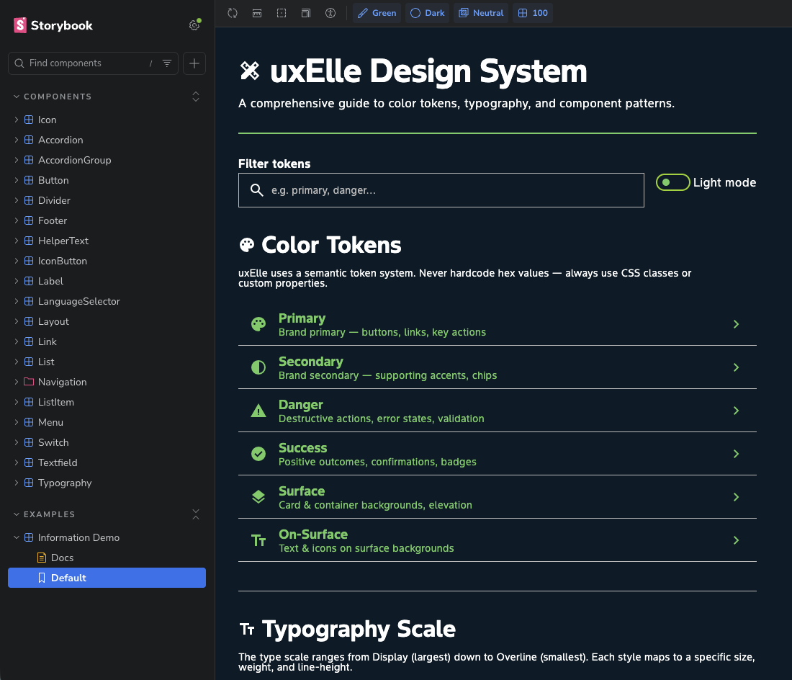
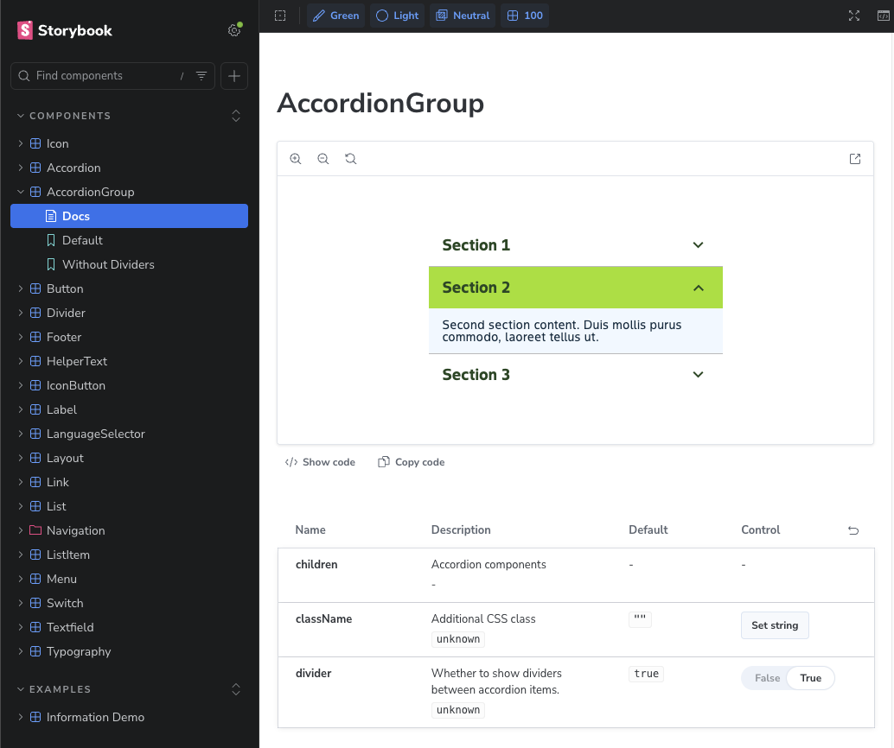

<div align="center">

<picture>
  
</picture>

<br />

# uxElle

### The next-gen React design system for Bayer

Build polished, accessible UIs from a single `npm install` — no CSS-in-JS runtime, no drama.

<br />

[](LICENSE)
[](https://nodejs.org)
[](https://react.dev)
[](#overview)

</div>

<br />

<div align="center">
<table>
<tr>
<td align="center"><strong>22 Components</strong><br /><sub>Actions &middot; Content &middot; Data<br />Navigation &middot; Layout &middot; Forms</sub></td>
<td align="center"><strong>Multi-Theme</strong><br /><sub>Green &amp; Velocity<br />Light + Dark modes</sub></td>
<td align="center"><strong>Zero Runtime</strong><br /><sub>Plain CSS &middot; PostCSS<br />No JS overhead</sub></td>
<td align="center"><strong>RSC Ready</strong><br /><sub><code>"use client"</code> marked<br />Next.js App Router</sub></td>
</tr>
</table>
</div>

<br />

---

## Table of Contents

- [Overview](#overview)
- [Quick Start](#quick-start)
- [Usage](#usage)
- [Components](#components)
- [Themes](#themes)
- [Project Structure](#project-structure)
- [Development](#development)
- [Architecture Decisions](#architecture-decisions)
- [Contributing](#contributing)
- [License](#license)

---

## Overview

UXElle provides **production-ready React components** styled with design tokens from Bayer's design language. Components ship as ESM and CJS with TypeScript declarations and a bundled CSS stylesheet.



---

## Quick Start

```bash
git clone https://github.com/Bayer-Group/bayer-uxelle.git && cd bayer-uxelle
npm install
npm run dev        # Storybook + watch mode
```

> **That's it.** Three commands and you're live.

---

## Usage

```tsx
import { Button, Typography, Icon } from "@uxelle/components";
import "@uxelle/components/styles.css";

function App() {
  return (
    <Button variant="primary" size="md">
      Get Started
    </Button>
  );
}
```

Theme tokens (colors, spacing, typography scales) are provided separately via CSS custom properties — see the [`themes/`](themes/) directory.

---

## Components

<table>
<tr><th align="left">Category</th><th align="left">Components</th></tr>
<tr>
  <td><strong>Actions</strong></td>
  <td><code>Button</code> &middot; <code>IconButton</code> &middot; <code>Link</code> &middot; <code>NavButton</code> &middot; <code>Switch</code></td>
</tr>
<tr>
  <td><strong>Content</strong></td>
  <td><code>Typography</code> &middot; <code>Icon</code> &middot; <code>Divider</code> &middot; <code>Label</code> &middot; <code>HelperText</code></td>
</tr>
<tr>
  <td><strong>Data</strong></td>
  <td><code>List</code> &middot; <code>ListItem</code> &middot; <code>ListColumns</code> &middot; <code>Accordion</code> &middot; <code>AccordionGroup</code></td>
</tr>
<tr>
  <td><strong>Navigation</strong></td>
  <td><code>Navigation</code> &middot; <code>Menu</code> &middot; <code>LanguageSelector</code> &middot; <code>LanguageSelectorButton</code></td>
</tr>
<tr>
  <td><strong>Layout</strong></td>
  <td><code>Layout</code> &middot; <code>Footer</code></td>
</tr>
<tr>
  <td><strong>Form</strong></td>
  <td><code>Textfield</code></td>
</tr>
</table>

<div align="center">

</div>

---

## Themes

uxElle ships with two theme packages, each supporting **light and dark modes**:


| Theme | CSS File | Brand |
| :--- | :--- | :--- |
| **Green** | `themes/green/green.css` | Bayer Crop Science |
| **Velocity** | `themes/velocity/velocity.css` | Velocity |

Apply a theme via `data-*` attributes on any parent element for scoped theming, color-mode switching, decorative palettes, and responsive breakpoint tokens.

---

## Project Structure

```text
bayer-uxelle/
├── packages/
│   └── components/       @uxelle/components — core React library
├── apps/
│   └── storybook/        @uxelle/storybook — dev & documentation
├── themes/               Design token CSS outputs + manifest
├── docs/
│   └── adr/              Architecture Decision Records
└── package.json          Monorepo root (npm workspaces)
```

---

## Development

Monorepo managed with **npm workspaces**. All scripts run from the root:

| Script | What it does |
| :--- | :--- |
| `npm run dev` | Components in watch mode + Storybook |
| `npm run build` | Build every package |
| `npm run lint` | Type-check all packages |
| `npm run lint:eslint` | ESLint pass |
| `npm run format` | Prettier pass |
| `npm run clean` | Nuke all `dist/` directories |

### Requirements

| Dependency | Version |
| :--- | :--- |
| **Node.js** | >= 22 |
| **npm** | ships with Node |

---

## Architecture Decisions

Key technical choices are documented as ADRs in [`docs/adr/`](docs/adr/):

| ADR | Decision |
| :--- | :--- |
| [001](docs/adr/001-react-frontend-framework.md) | React as the frontend framework |
| [002](docs/adr/002-tailwind-css-styling.md) | Tailwind CSS for styling |
| [003](docs/adr/003-nextjs-ssr-compatibility.md) | Next.js SSR compatibility |
| [004](docs/adr/004-npm-package-manager.md) | npm as the package manager |
| [005](docs/adr/005-npm-workspaces-monorepo.md) | npm workspaces for the monorepo |
| [006](docs/adr/006-tsup-bundler.md) | tsup as the bundler |

---

## Contributing

We welcome contributions! Please read our [Contribution Guidelines](CONTRIBUTING.md) before submitting a pull request.

---

<div align="center">

<br />

**Built with care at Bayer.**

[MIT License](LICENSE) &copy; 2026 Bayer AG

<br />

</div>
